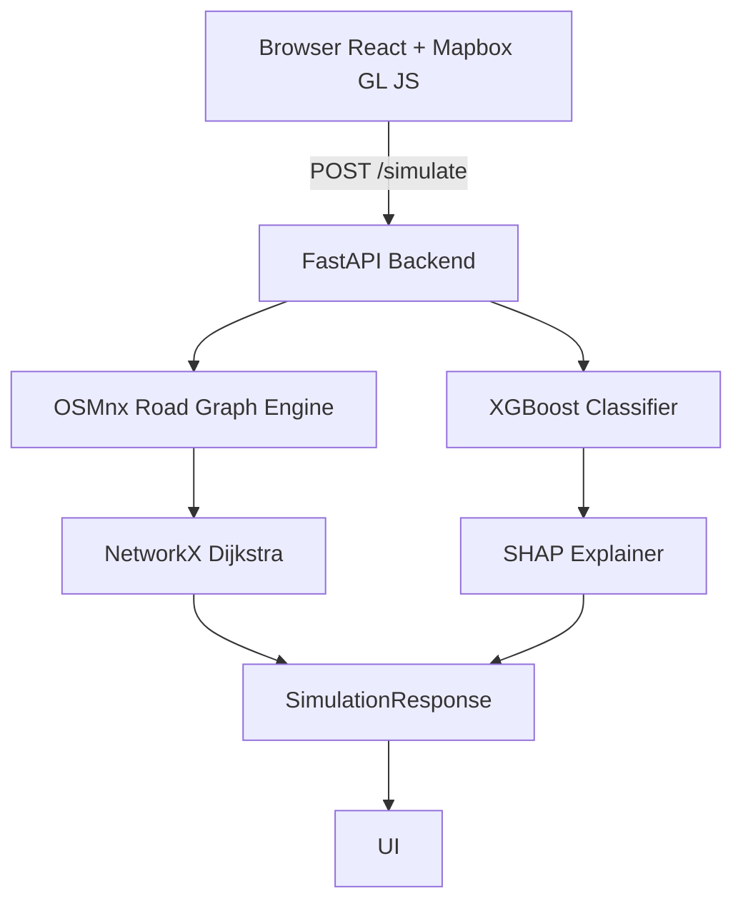

# Boston Logistics Simulator

> An AI-powered urban logistics simulation tool for Boston. Predict grocery access times, store stockout risk, and optimal store placement under simulated disruptions.

[Demo Video](your-loom-link-here) · [GitHub](https://github.com/lemur-cpu/boston-logistics-sim)

---


---

## What It Does

The simulator models Boston's grocery supply chain as a live road network, letting you toggle store closures, spike neighborhood demand, and introduce road disruptions. 
A reverse-graph Dijkstra pass computes real-time access times for each neighborhood across the full OSM road network. 
An XGBoost classifier predicts per-store stockout probability with SHAP explanations, and a facility siting algorithm recommends optimal locations for new stores based on current access gaps.

---

## Architecture


---

## Tech Stack

| Layer     | Tech                                                |
|-----------|-----------------------------------------------------|
| Frontend  | React 18, TypeScript, Vite, Mapbox GL JS, Zustand  |
| Backend   | Python, FastAPI, OSMnx, NetworkX                   |
| ML        | XGBoost, SHAP, scikit-learn                        |
| Data      | OSM Overpass, USDA FARA, Census ACS                |

---

## Local Setup

### Prerequisites
- Python 3.11+
- Node.js 18+
- Mapbox account (free tier)

### Backend

```bash
cd backend
python -m venv .venv && source .venv/bin/activate
pip install -r requirements.txt

# Build data assets (one-time, takes ~2 min)
python scripts/build_graph.py
python scripts/fetch_stores.py
python scripts/generate_training_data.py

# Train model (one-time)
# Run notebooks/train_stockout_model.ipynb

# Start server
uvicorn app.main:app --reload --port 8000
```

### Frontend

```bash
cd frontend
npm install
cp .env.example .env
# Add your Mapbox token to .env
npm run dev
```

Visit http://localhost:5173

---

## Dataset Sources

| Dataset      | Source           | Use                    |
|--------------|------------------|------------------------|
| Road network | OpenStreetMap    | Graph traversal        |
| Grocery stores | OSM Overpass API | Store locations      |
| Neighborhoods | Analyze Boston  | Choropleth + centroids |
| Demographics | Census ACS       | Population weights     |
| Food access  | USDA FARA        | Stockout features      |

---

## Model Notes

The stockout risk classifier (XGBoost) was trained on synthetically generated labels derived from a deterministic demand-disruption scoring rule applied to real store and neighborhood data.

- AUC-ROC: 0.9982 on held-out synthetic data
- High AUC is expected — the model recovers a known scoring rule
- In production, labels would be replaced with POS-derived stockout events; the pipeline architecture is identical
- SHAP values computed per inference call, top 2 factors surfaced in UI

---

## Project Structure

```
boston-logistics-sim/
├── frontend/          # React + Mapbox GL JS
│   └── src/
│       ├── components/  # Map, ControlPanel, MetricsBar, etc.
│       ├── store/       # Zustand simulation state
│       └── hooks/       # API integration
├── backend/
│   ├── app/
│   │   ├── routes/      # FastAPI endpoints
│   │   ├── graph/       # OSMnx road graph engine
│   │   └── models/      # XGBoost inference + SHAP
│   ├── scripts/         # One-time ETL scripts
│   └── notebooks/       # Model training
└── README.md
```
